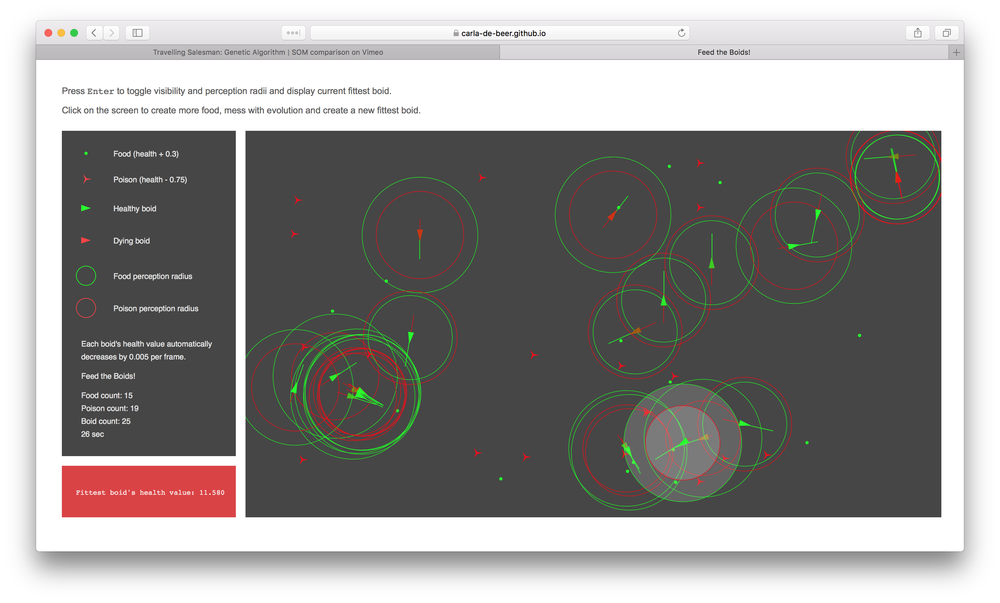

# Feed-the-Boids

Evolutionary steering game based on Daniel Shiffman's Coding Train video: https://www.youtube.com/watch?v=qzFlnX-z38U

* Press Enter to toggle visibility and perception radii and display current fittest boid.
* Click on the screen to create more food, mess with evolution and create a new fittest boid.

To view this project, navigate to: https://carla-de-beer.github.io/Feed-the-Boids/index.html

Built with P5js and RequireJS.

 

  

